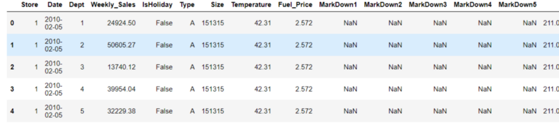
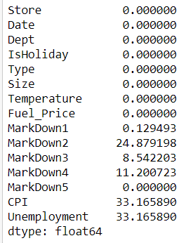
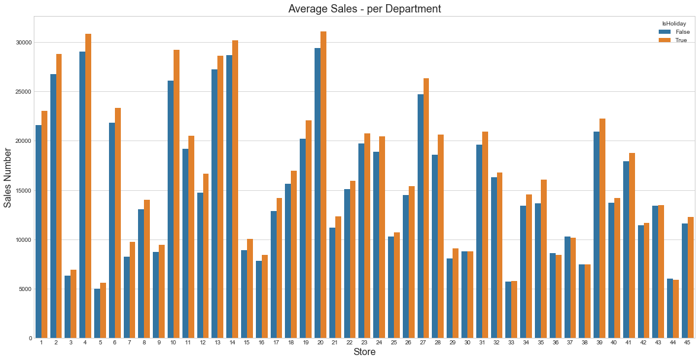

## Walmart Store Sales Forecasting


### Kaggle Problem Definition
Walmart is a supermarket chain in the USA. Currently, they have opened their stores all over the world.
Predicting future sales for a company like Walmart is one of the most important aspects of strategic planning. Based on the sales number they can take an informed decision for the short term and long term. The future sales number also help to recruit contract employee based on sales. It will also help a Walmart store to work more efficient way.

### The Big Question - Why we need a Machine Learning approach?
They have multiple stores in various location across the world. There may have different sales pattern in different store placed in different locations. To identify this pattern and predict future sales, we should have a complete solution. Here, we can take a machine learning approach to create this complete solution. 
If we have a trained model, predicting the sales number of a store shouldn't be a tedious task to do. It will save lots of human time.

## Overview of this Blog:
- **Part-1: Kaggle Data**
- **Part-2: Exploratory Data Analysis (EDA)**
- **Part-3: Data Pre-Processing & Feature Extraction**
- **Part-4: Machine Learning Regression Models**
- **Part-5: The Model got the lowest error**
- **Part-6: Future Work**

### Part-1: Kaggle Data
We are provided with historical sales data for 45 Walmart stores located in different regions. Each store contains many departments, and you are tasked with predicting the department-wide sales for each store.

In addition, Walmart runs several promotional markdown events throughout the year. These markdowns precede prominent holidays, the four largest of which are the Super Bowl, Labor Day, Thanksgiving, and Christmas. The weeks including these holidays are weighted five times higher in the evaluation than non-holiday weeks. Part of the challenge presented by this competition is modelling the effects of markdowns on these holiday weeks in the absence of complete/ideal historical data.

**stores.csv**<br />
This file contains anonymized information about the 45 stores, indicating the type and size of the store.

**train.csv**<br />
This is the historical training data covering 2010–02–05 to 2012–11–01. Within this file you will find the following fields:
- Store - the store number
- Dept - the department number
- Date - the week
- Weekly_Sales - sales for the given department in the given store
- IsHoliday - whether the week is a special holiday week

**test.csv**<br />
This file is identical to train.csv, except we have withheld the weekly sales. You must predict the sales for each triplet of store, department, and date in this file.

**features.csv**
This file contains additional data related to the store, department, and regional activity for the given dates. It contains the following fields:
- Store - the store number
- Date - the week
- Temperature - the average temperature in the region
- Fuel_Price - the cost of fuel in the region
- MarkDown1–5 - anonymized data related to promotional markdowns that Walmart is running. MarkDown data is only available after Nov 2011 and is not available for all stores all the time. Any missing value is marked with an NA.
- CPI - the consumer price index
- Unemployment - the unemployment rate
- IsHoliday - whether the week is a special holiday week

There are 4 holidays mentioned in the dataset

1. Super Bowl: 12-Feb-10, 11-Feb-11, 10-Feb-12, 8-Feb-13
2. Labor Day: 10-Sep-10, 9-Sep-11, 7-Sep-12, 6-Sep-13
3. Thanksgiving: 26-Nov-10, 25-Nov-11, 23-Nov-12, 29-Nov-13
4. Christmas: 31-Dec-10, 30-Dec-11, 28-Dec-12, 27-Dec-13

The performance Metric of this competition is the Weighted Mean Absolute Error(**WMAE**). As per the Kaggle page, the weight of the week which has a holiday is 5 otherwise 1. That means Walmart is more focused on the holiday week and they want to have less error on that week. We also focus on that part as well and try to reduce the error.


### Part-2: Exploratory Data Analysis (EDA)
At first, we want to load all CSV files
```python
#Sales Data
train_data = pd.read_csv("train/train.csv")
test_data = pd.read_csv("test/test.csv")

#Features.csv
feature_data = pd.read_csv("features.csv")

#Stores.csv
store_data = pd.read_csv("stores.csv")
```
Currently, we have multiple data frames. Let join those data frames.
```python
#Join The Train data
train_all = train_data.set_index("Store").join(store_data.set_index("Store"))
train_all.reset_index(inplace=True)
train_all = train_all.set_index(["Store","Date"]).join(feature_data.set_index(["Store","Date"]))
train_all.reset_index(inplace=True)
#Train data size
print(train_all.shape)
train_all.head()
```


Now, check the number of NaN values for each column for both Train and Test data.


**Train Data**
```python
print(train_all.isnull().sum())
print(train_all.isnull().sum()*100.0/train_all.shape[0])
```


**Test Data**
```python
print(test_all.isnull().sum())
print(test_all.isnull().sum()*100.0/test_all.shape[0])
```



##### Observations
1. There are more than 60 per cent markdowns that are NULL. As per the competition page Markdowns are available after Nov 2011. For the data before Nov 2011, the markdowns should be zero.
2. For one-third of the test data the CPI and Unemployment. These were depend on the location and time. But it cannot be changed drastically. So we can impute store location-wise mean of these columns.

Let's fill in the NaN values -
```python
#Replace CPI & Unemployment
test_all['CPI'] = test_all['CPI'].fillna(train_all.groupby('Store')['CPI'].transform('mean'))
test_all['Unemployment'] = test_all['Unemployment'].fillna(train_all.groupby('Store')['Unemployment'].transform('mean'))
#Replace the Markdowns with zero
train_all.fillna(0, inplace=True)
test_all.fillna(0, inplace=True)
```

#### Store Type Vs Size
```python
sns.set_style("whitegrid")
ax = sns.boxplot(x='Type', y='Size', data=train_all).set_title("Box Plot of Type vs Size")
```


##### Observations
1. Store Size is very different for different types of store.

#### Highest Sales of a Week for a Department
```python
train_all_new = train_all.sort_values('Weekly_Sales',ascending=False)
train_all_new = train_all_new.head(50)
train_all_new['Week'] = train_all_new['Date'].dt.week
train_all_new['Month'] = train_all_new['Date'].dt.month
train_all_new['Year'] = train_all_new['Date'].dt.year
#Pick top 100 rows
print(tabulate(train_all_new[['Store','Dept','Size','Type','Week','Month','Year','Weekly_Sales']], headers='keys', tablefmt='psql', showindex=False))
```


##### Observations
1. The highest sales are available on the week of Thanksgiving and the week before Christmas.
2. Most of the sales take place in the department of 7 and 72

#### Average Weekly sales over the time
```python
avg_sales = train_all.groupby('Date')[['Weekly_Sales']].mean().reset_index()
fig = plt.figure(figsize=(18,6))
plt.plot(avg_sales['Date'], avg_sales['Weekly_Sales'])
plt.xlabel("Time --->", fontsize=16)
plt.ylabel("Weekly Sales --->", fontsize=16)
plt.title("Average weekly sales over time", fontsize=18)
plt.show()
```


#### Let zoom the sales number over the year
```python
avg_sales = train_all.groupby('Date')[['Weekly_Sales']].agg(['mean','median']).reset_index()
avg_sales['Week'] = avg_sales['Date'].dt.week
avg_sales_2010 = avg_sales[avg_sales['Date'].dt.year == 2010]
avg_sales_2011 = avg_sales[avg_sales['Date'].dt.year == 2011]
avg_sales_2012 = avg_sales[avg_sales['Date'].dt.year == 2012]
#Plot the model
fig = plt.figure(figsize=(18,6))
plt.plot(avg_sales_2010['Week'], avg_sales_2010['Weekly_Sales']['mean'], label='Year 2010 Mean Sales')
plt.plot(avg_sales_2010['Week'], avg_sales_2010['Weekly_Sales']['median'], label='Year 2010 Median Sales')
plt.plot(avg_sales_2011['Week'], avg_sales_2011['Weekly_Sales']['mean'], label='Year 2011 Mean Sales')
plt.plot(avg_sales_2011['Week'], avg_sales_2011['Weekly_Sales']['median'], label='Year 2011 Median Sales')
plt.plot(avg_sales_2012['Week'], avg_sales_2012['Weekly_Sales']['mean'], label='Year 2012 Mean Sales')
plt.plot(avg_sales_2012['Week'], avg_sales_2012['Weekly_Sales']['median'], label='Year 2012 Median Sales')
plt.xticks(np.arange(1, 53, step=1))
plt.grid(axis='both',color='grey', linestyle='--', linewidth=1)
plt.legend()
plt.xlabel("Week --->", fontsize=16)
plt.ylabel("Weekly Sales --->", fontsize=16)
plt.title("Average/Median weekly sales of the Different Week Over a year", fontsize=18)
```


##### Observations
1. The Sales Number from last November to December are much bigger than a normal week.
2. The Sales number are minimum after December.
3. We can see a spike for Super Bawl.
4. In January the average sales are low.

Now, Let's try to find the pattern of Weekly sales for some departments.

```python
avg_sales_depart = train_all.groupby(['Date','Dept'])[['Weekly_Sales']].mean().reset_index()
#PLot for department 1 to 10

fig = plt.figure(figsize=(18,6))
for depart in range(1,11):
    avg_sales_depa_curr = avg_sales_depart[avg_sales_depart['Dept'] == depart]
    plt.plot(avg_sales_depa_curr['Date'], avg_sales_depa_curr['Weekly_Sales'], label='Department ' + str(depart))
    
plt.xlabel("Time --->", fontsize=16)
plt.ylabel("Weekly Sales --->", fontsize=16)
plt.title("Average weekly sales over time for department 1 to department 10",, fontsize=18)
plt.legend()
plt.show()
```


Similarly, we can plot the same data for 11 to 20 and 20 to 30


##### Observations
1. Each Department has its own behaviour.
2. For some of the department pattern of sales, the number is similar to the average sales number of all departments.
3. We should have different models for different departments.

**Here I have decided to train a model for each store and department.**

#### Average weekly sales with store category and size
In the below plot I am trying to plot average sales with the store and the size of the bubble is denoting the size of the store.
```python
avg_sales = train_all.groupby(['Store','Size', 'Type'])[['Weekly_Sales']].mean().reset_index()

fig = px.scatter(avg_sales, x="Store", y="Weekly_Sales",
	         size="Size", color="Type",
                 hover_name="Store", log_y=True,
                 size_max=60, title="Average Weekly Sales number with size and categoty of the store")
fig.show()
```

Here, I am trying to plot average sales with store and size of the bubble is denoting the size of the store.

##### Observations
1. Some stores are in A or B category but the sizes of those store are leas than the size of any C category store.
2. Here we can see a broad partern that the store has more size have more sale numbers.

#### Store wise Average Sales Numbers Holiday vs Non Holiday week

```python
weekly_sales_dept = train_all.groupby(["Store","IsHoliday"])[["Weekly_Sales"]].mean().reset_index()
plt.figure(figsize=(20,10))
sns.set_style("whitegrid")
ax = sns.barplot(x="Store", y="Weekly_Sales",hue="IsHoliday", data=weekly_sales_dept)
plt.title('Average Sales - per Department', fontsize=18)
plt.ylabel('Sales Number', fontsize=16)
plt.xlabel('Store', fontsize=16)
plt.show()
```
Here we are trying to compare average sales of a store on a holiday week and non-holiday week.


##### Observations
1. Most of the stores have better sales number in the holliday week.

#### Storewise average percentage sale
```python
weekly_sales_dept = train_all.groupby(["Store", 'Type'])[["Weekly_Sales"]].mean().reset_index()
weekly_sales_mean = weekly_sales_dept["Weekly_Sales"].sum()
weekly_sales_dept['Percentage'] = weekly_sales_dept['Weekly_Sales']/weekly_sales_mean*100
weekly_sales_dept = weekly_sales_dept.sort_values('Percentage', ascending=False).reset_index()
weekly_sales_dept['Store Number'] = str(weekly_sales_dept['Store'])

plt.figure(figsize=(24,10))
sns.set_style("whitegrid")
ax = sns.barplot(x="Store", y="Percentage", data=weekly_sales_dept, palette='deep',order=weekly_sales_dept['Store'],hue='Type', dodge=False )

for p in ax.patches:
    ax.annotate(str(format(p.get_height(), '.2f'))+"%", 
                   (p.get_x() + p.get_width() / 2., p.get_height()), 
                   ha = 'center', va = 'center', 
                   size=12,
                   xytext = (0, -20),
                   rotation=90,
                   weight='bold',
                   color='white',
                   textcoords = 'offset points')
    
plt.title('Average Sales - per Department', fontsize=18)
plt.ylabel('Average Sales Number', fontsize=16)
plt.xlabel('Store', fontsize=16)
plt.show()
```


##### Observations
1. Some A category store has less average sales number than some B or C category.
2. Most of A category stores have more number than B or C category.

#### Department wise Average Sales Numbers Holiday vs Non Holiday week

```python
weekly_sales_dept = train_all.groupby(["Dept","IsHoliday"])[["Weekly_Sales"]].mean().reset_index()
plt.figure(figsize=(20,10))
sns.set_style("whitegrid")
ax = sns.barplot(x="Dept", y="Weekly_Sales",hue="IsHoliday", data=weekly_sales_dept)
plt.title('Average Sales - per Department', fontsize=18)
plt.grid(axis='y',color='gray', linestyle='--', linewidth=1)
plt.ylabel('Sales Number', fontsize=16)
plt.xlabel('Departments', fontsize=16)
plt.show()
```
Here we are trying to compare average sales of a department on a holiday week and non-holiday week.


##### Observations
1. For Some departments, the increases in Holiday sales are bigger than the others. 
2. But in most of the departments, the holiday sales is the range of the average sales.

#### Store vs Departments

Let find the highest number of department of a store
```python
store_Dept = train_all.groupby(['Store'])[['Dept']].nunique().reset_index().sort_values('Dept', ascending=False)
store_Dept.head()
```


##### Observations
1. Here we have a critical observation. For each store the number of departments available in that store is different. If we have a model for each store and department then there may be an issue if a new department is introduced in future.
2. We have to check the above scenario is present or not in our test data.

Let us find the distinct count of Store and Department in the training data is **3331** and the same distinct count of test data is **3169**. But between these two distinct lists of Store and Department, **3158** combinations are common. That means there are **11** combinations of Store and Department available in test data but not available in train data.

#### Average Sales behaviour Over a month
Lets find the average sales of a week for each months. In the plot, Month are shown in numbers. Thats mean Month 1 is January.
```python
train_all['Month'] = train_all['Date'].dt.month
train_all['Week'] = train_all['Date'].dt.week
train_all['Week_Of_Month'] = (np.floor(train_all['Date'].dt.day/7+1))

avg_sale_week_month = train_all.groupby(['Month','Week_Of_Month'])[['Weekly_Sales']].mean().reset_index()

plt.figure(figsize=(20,12))
for k in range(1,13):
    ax = plt.subplot(3,4,k)
    avg_sale_curr = avg_sale_week_month[avg_sale_week_month['Month'] == k]
    
    sns.set_style("whitegrid")
    ax1 = sns.barplot(x="Week_Of_Month", y="Weekly_Sales", data=avg_sale_curr,ax=ax)
    ax1.set_title("Average sales on month " + str(k));
plt.show()
```


##### Observations
1. For most of the months, the first week of the month has more sales number than the last week of that months. I add a feature called the week of a month.
2. In November, I have seen different behaviour than in other months. The last week of November has Thanksgiving day and the sales number is high for this week.
3. In December, we have the Christmas holiday in the last week of the year. But sales number are pretty low this week. People did their Christmas shopping in the prior week.

#### Let try to analyze the the Sales of last 2 weeks

```python
# Find all records for last 2 weeks
train_all['Year'] = train_all['Date'].dt.year
train_all_Dec = train_all[(train_all['Month'] == 12) & ((train_all['Week'] == 51) | (train_all['Week'] == 52))]

train_all_Dec_grp1 = train_all_Dec.groupby('Date')[['Weekly_Sales']].mean().reset_index()
train_all_Dec_grp1['Date2'] = train_all_Dec_grp1['Date'].apply(lambda x  : str(x.year) + "-" + str(x.month)+"-"+str(x.day))
sns.set_style("whitegrid")
ax = sns.barplot(x="Date2", y="Weekly_Sales", data=train_all_Dec_grp1)
for index, row in train_all_Dec_grp1.iterrows():
    ax.text(row.name,row.Weekly_Sales, round(row.Weekly_Sales,2), color='black', ha="center")
plt.title('Average Sales of last 2 weeks of the year', fontsize=18)
plt.grid(axis='y',color='gray', linestyle='--', linewidth=1)
plt.ylabel('Sales Number', fontsize=16)
plt.xlabel('Date', fontsize=16)
plt.show()
```


##### Observations
1. In 2010, there are no days between the second last week and the Christmas day but in 2011, there is one day. This is one of the reasons to have a bigger last week sales number in 2011 compared to 2010.
2. Sum of sales number of the last 2 week of a year has similar number. 

#### Compare sales of a holiday week with previous and post week

```python
train_all['Year'] = train_all['Date'].dt.year
train_all['Week'] = train_all['Date'].dt.week

all_holiday_week = train_all[train_all['IsHoliday'] == True]['Week'].unique()
train_all_filtered = train_all[train_all['Week'].isin(all_holiday_week) | (train_all['Week']+1).isin(all_holiday_week) |(train_all['Week'] == 1) | (train_all['Week']-1).isin(all_holiday_week)]
filtered_week_sum = train_all_filtered.groupby('Week')[['Weekly_Sales']].mean().reset_index()
#train_all_filtered['Week'].unique()
all_holiday = ['Super Bowl','Labour Day', 'ThanksGiving', 'Christmas']
filtered_week_sum['HolidayCat'] = filtered_week_sum.apply(labelHoliday,axis=1)
filtered_week_sum['PreOrPost'] = filtered_week_sum.apply(preOrPost,axis=1)
#Taking the pivot
train_pivot = filtered_week_sum.pivot(index='HolidayCat', columns='PreOrPost', values='Weekly_Sales').reset_index()
train_pivot['Percentage_Sale_Increase_From_PreviousWeek'] = train_pivot.apply(lambda x: 100*(x['HolidayWeek'] - x['PreWeek'])/x['HolidayWeek'], axis=1)
train_pivot['Percentage_Sale_Decrease_In_PostWeek'] = train_pivot.apply(lambda x: 100*(x['HolidayWeek'] - x['PostWeek'])/x['HolidayWeek'], axis=1)
print(tabulate(train_pivot[['HolidayCat','Percentage_Sale_Increase_From_PreviousWeek','Percentage_Sale_Decrease_In_PostWeek']], headers='keys', tablefmt='psql', showindex=False))
```


##### Observation
1. For Christmas Week, people are made their shopping in the prior week.
2. Thanksgiving week has an almost 30% sales jump compared to the previous week and an almost 25% sale decrease in the post week.


#### Find the importance of Fuel price
```python

fig = plt.figure(figsize=(20,6))
sns.set_style("whitegrid")
col = 'Fuel_Price'
m = CalculateAverege(col, 'high', 1)
plt.title("For high Fuel Price Month " + str(m),fontsize = 16)
plt.ylabel("Percentage increase from previous month",fontsize = 16)
m = CalculateAverege(col, 'min', 2)
plt.title("For Min Fuel Price Month " + str(m),fontsize = 16)
plt.ylabel("Percentage increase from previous month",fontsize = 16)
m = CalculateAverege(col, 'median', 3)
plt.title("For Median Fuel Price Month " + str(m),fontsize = 16)
plt.ylabel("Percentage increase from previous month",fontsize = 16)
fig.suptitle("Variation of Sales with previous month with Fuel price",fontsize = 22)

plt.show()

```


##### Observations
1. We have seen that average weekly sales are increased from the previous month irrespective of fuel price.
2. In minimum fuel price month, price down by 3.5 per cent and the sale was increased by 11.8 per cent. There may be a reason for the fuel price decrease. We have to consider that this month has a holiday.


#### Similarly, we can get a similar plot for Temperature, CPI and Unemployment Rate


##### Observations
1. For the Minimum temperature month, there is a huge decrease in sales compared to the previous month.
2. When the temperature is high then also the sales number is low compare to the previous month.


##### Observations
1. There is not much variation in CPI. It seems that the Sales number is not dependent on CPI. 


##### Observations
1. The max unemployment rate in December and in this month, huge sale increase in December compare ro the previous month.

#### Lets find the correlation between different features


```python
corr = train_all.corr()
sns.set_style("whitegrid")
plt.figure(figsize=(15, 10))
sns.heatmap(corr, annot=True, cmap="YlGnBu")
plt.plot()
plt.title("Pearson Corelation Heatmap", fontsize=18)
plt.show()
```


#### Let's plot Spearman Correlation


##### Observations

1. There are very low correlations with the Sales number for most of the columns. 

I am keeping all columns except markdowns. We will create some extra columns for the date. You can find it in the data Preprocessing section.

### Part-3: Data Pre-Processing & Feature Extraction
In this section, we have done the below steps - 
1. Dropped  all markdowns.
2. Extracted some property from the Date columns
	- Year
	- Month
	- Day
	- Week of Month
	- Week Number of the Year
	- Days to Crismas
3. One hot encoding for the Store type
4. Drop the Date & Type

```python
#This is the function which will do all the featurizarion and add new feature
def add_drop_feature(df):
    #droping all markdowns
    columns_drop = ['MarkDown1','MarkDown2','MarkDown3','MarkDown4','MarkDown5']
    for col in columns_drop:
        if col in df.columns:
            df.drop(col, axis=1, inplace=True)
    df['Date'] = pd.to_datetime(df['Date'])
    df['Year'] = df['Date'].dt.year
    df['Month'] = df['Date'].dt.month
    df['Day'] = df['Date'].dt.day
    df['Week_Of_Month'] = (np.floor(df['Date'].dt.day/7+1))    
    df['Week'] = df['Date'].dt.week
    
    df['Days_to_Christmas'] = (pd.to_datetime(df['Year'].astype(str)+"-12-25", format="%Y-%m-%d") - df['Date']).dt.days.astype(int)
    
    ohe_type = pd.get_dummies(df.Type)
    
    df = pd.concat([df, ohe_type], axis=1)
    
    df = df.drop(['Date', 'Type'], axis=1)
    
    return df
train_df_final = add_drop_feature(train_df)
train_df_final.head()
```


```python
test_df_final = add_drop_feature(test_df)
test_df_final.head()
```


**Now, Save Train and Tesr data to a .csv file and we can use those files while training and testing the module.**

```python
train_df_final.to_csv('train_all_features.csv', index=False)
test_df_final.to_csv('test_all_features.csv', index=False)
```

### Part-4: Machine Learning Regression Models

I have trained a model for each store and department combinations available in the train data. But I have noticed that for some stores and departments there are very few records available in the train data. So I decided that I will train a model when at least **5** records are available in the train data. We will split the data between train and test of a Store and Department. The test size is **0.2**. I have tried 4 different models - 

1. Random Forest Regressor
2. XGBoost Regressor
3. Extra Trees Regressor
4. Prophet

I have prepared a function to calculate **WMAE**. I have used this function extensively.
```python
def calculate_WMAE(dt, y , yHat):
    '''
        This is the method to calculate Performance metric
    '''    
    w = dt['IsHoliday'].apply(lambda x : 5 if x else 1)
    return np.round(np.sum(w*abs(y-yHat))/np.sum(w),4)
```

#### 1. Random Forest Regressor
At first, split the data into train and cross-validation datasets. Train the Random Forest regressor on the training dataset. After that find the WAME error on the cross-validation datasets. Repeat these steps for multiple hyperparameters. 

After that, pick the best model basis on **WAME(minimum)** scores.

Train the Random Forest regressor model with the hyperparameters of the best model. **This time train data will be the complete data for the current Store and Department**. 

**Save a Random Forest regressor model for all applicable Store & Department combinations**. After completing the training, there are **3227 trained Random Forest Regressor models** stored on the hard disk. 

All hyperparameters used to train the model are given below.

```python
#Selecting some random hyper Parameters
RF_HF = dict(n_estimators=[10,20,30,40,50,60,75],
            max_depth=[3,5,7,9,11,15],
            max_features = [2,3,4,5,6,7,8,9],
            min_samples_split = [2,3,4],
            min_samples_leaf = [1,2,3])
```
Next, randomly pick the hyperparameters from the above list and train the regressor model.
```python
esti = choice(RF_HF['n_estimators'])
md = choice(RF_HF['max_depth'])
mf = choice(RF_HF['max_features'])
mss = choice(RF_HF['min_samples_split'])
msl = choice(RF_HF['min_samples_leaf'])

#Initialize the model
rf = RandomForestRegressor(n_estimators=esti
      ,max_depth=md
       ,max_features = mf
       ,min_samples_split = mss
       ,min_samples_leaf = msl
       ,n_jobs=-1)

#Train the Random Forest model
rf.fit(train_X,train_y)
```

Now, predict the sales number and calculate **WMAE** and keep this error number to pick the best-tuned model.
```python
y_hat = rf.predict(test_X)
wmae_score = calculate_WMAE(test_X,test_y,y_hat)
```
After running these steps multiple times(20), pick the best model and train this with complete data. After training, save this model in a pickle file.
```python
filename = 'Models/RandomForest/RF_'+str(s)+'_'+str(d)+'V1.pkl'

with open(filename, 'wb') as file:
	pickle.dump(model, file)
```
Let’s find the feature importance of the Random Forest regressor model for some random Store and Department.
```python
 with open('Models/RandomForest/RF_1_1V1.pkl', 'rb') as file:
    pickle_model = pickle.load(file)
    
plt.figure(figsize=(20,10))
sns.set_style("whitegrid")
ax = sns.barplot(x=train_df_final.columns[3:], y=pickle_model.feature_importances_)
plt.title('Random Forest - Feature Importance Store 1 Dept 1 ', fontsize=18)
plt.ylabel('Feature Importance', fontsize=16)
plt.xlabel('Feature', fontsize=16)
plt.show()
```


#### 2. XGBoost Regressor
We will follow the same approach for XGBoost Regressor like Random Forest regressor. We will split the data in the same ratio to train and cross-validate the model. After training multiple models for multiple hyperparameters, we will pick the best model which has min WMAE and we will train the best model with the complete data and save the model in a pickle file.

All hyperparameters used to train the model are given below.
```python
XGB_HF = dict(n_estimators=[10,20,30,40,50,60,75],
    max_depth=[2,3,5,7,9,11,15],
    learning_rate = [0.001,0.003,0.01,0.03,0.1])
```

Next, randomly pick the hyperparameters from the above list and train the regressor model.
```python
esti = choice(XGB_HF['n_estimators'])
md = choice(XGB_HF['max_depth'])
lr = choice(XGB_HF['learning_rate'])

#Initialize the model
rf = xgb.XGBRegressor(n_estimators=esti
		      ,max_depth=md
		       ,learning_rate = lr
		       ,n_jobs=-1)

#Train the Random Forest model
rf.fit(train_X,train_y)

#Calculate WMAE 
y_hat = rf.predict(test_X)
wmae_score = calculate_WMAE(test_X,test_y,y_hat)
```

After running these steps multiple times(20), pick the best model and train this with complete data. After training, save this model in a pickle file.

```python
filename = 'Models/XGBoost/XGB_'+str(s)+'_'+str(d)+'V'+str(v)+'.pkl'

with open(filename, 'wb') as file:
    pickle.dump(model, file)
```

Let’s find the feature importance of the XGBoost regressor model for the same Store and Department for which we have seen in the case of Random Forest regressor.

```python
 with open('Models/XGBoost/XGB_1_1V1.pkl', 'rb') as file:
    pickle_model = pickle.load(file)
  
plt.figure(figsize=(16,6))
sns.set_style("whitegrid")
ax = sns.barplot(x=train_df_final.columns[3:], y=pickle_model.feature_importances_)
plt.title('XGBoost - Feature Importance Store 1 Dept 1', fontsize=14)
plt.ylabel('Feature Importance', fontsize=16)
plt.xlabel('Feature', fontsize=16)
plt.show()
   
```


#### 3. Extra Trees Regressor

We will follow the same approach as the Random Forest or XGBoost regressor. We will split the data in the same ratio to train and cross-validate the model. After training multiple models for multiple hyperparameters, we will pick the best model which has min WMAE and we will train the best model with the complete data and save the model in a pickle file.

All hyperparameters used to train the model are given below.
```python
#Hyper parameter for the Extra Trees
ET_HF = dict(n_estimators=[10,20,30,40,50,60,75],
    max_depth=[3,5,7,9,11,15],
    max_features = [2,3,4,5,6,7,8,9],
    min_samples_split = [2,3,4],
    min_samples_leaf = [1,2,3])
```
Next, randomly pick the hyperparameters from the above list and train the regressor model.

```python
#Selecting some random hyper Parameter
esti = choice(ET_HF['n_estimators'])
md = choice(ET_HF['max_depth'])
mf = choice(ET_HF['max_features'])
mss = choice(ET_HF['min_samples_split'])
msl = choice(ET_HF['min_samples_leaf'])

#Initialize the model
rf = ExtraTreesRegressor(n_estimators=esti
		      ,max_depth=md
		       ,max_features = mf
		       ,min_samples_split = mss
		       ,min_samples_leaf = msl
		       ,n_jobs=-1)

#Train the Extra Trees model
rf.fit(train_X,train_y)

#Calculate WMAE 
y_hat = rf.predict(test_X)
wmae_score = calculate_WMAE(test_X,test_y,y_hat)
```

After running these steps multiple times(20), pick the best model and train this with complete data. After training, save this model in a pickle file.

```python
filename = 'Models/XtraTrees/ET_'+str(s)+'_'+str(d)+'V'+str(v)+'.pkl'
with open(filename, 'wb') as file:
    pickle.dump(model, file)
```
Let’s find the feature importance of the EXtra Trees regressor model for the same Store and Department for which we have seen the feature importance of other models.

```python
 with open('Models/XtraTrees/ET_1_1V1.pkl', 'rb') as file:
    pickle_model = pickle.load(file)
    
plt.figure(figsize=(16,6))
sns.set_style("whitegrid")
ax = sns.barplot(x=train_df_final.columns[3:], y=pickle_model.feature_importances_)
plt.title('XGBoost - Feature Importance Store 1 Dept 1', fontsize=14)
plt.ylabel('Feature Importance', fontsize=16)
plt.xlabel('Feature', fontsize=16)
plt.show()
```


